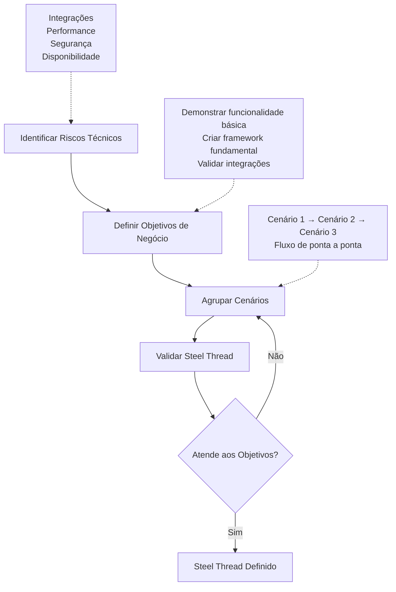

# Abordagem do Steel Threads para Testes de Software

## 📋 Visão Geral

Imagine que você precisa testar um sistema complexo com centenas de funcionalidades. Por onde começar? O que é mais importante?

Um **Steel Thread** (Fio de Aço) é o caminho mais crítico que percorre todo o sistema, de ponta a ponta. É como uma linha forte de aço que conecta as partes mais importantes do sistema. Se esse caminho quebrar, o sistema não funciona.

**Definição:** Um Steel Thread é um conjunto de cenários logicamente agrupados que identifica um caminho de execução de ponta a ponta através do sistema para atingir objetivos de negócio e demonstrar que a arquitetura funciona.

## 🎯 O Que é um Steel Thread?

### Características Principais

1. **Foca apenas no fluxo principal** - Ignora cenários alternativos e de exceção
2. **Percorre todo o sistema** - De uma ponta até a outra, passando por todas as camadas
3. **Valida a arquitetura** - Prova que o sistema funciona antes de construir tudo
4. **Mitiga riscos** - Identifica e resolve problemas técnicos no início

### Objetivos

- ✅ **Mitigar riscos técnicos** - Validar tecnologias e integrações antes de construir tudo
- ✅ **Demonstrar funcionalidade crítica** - Provar que o essencial funciona
- ✅ **Estabelecer fundação sólida** - Criar base para o restante do sistema

## 🔍 Steel Threads vs. Requisitos

| Aspecto | Requisitos / Casos de Uso | Steel Threads |
| :------ | :------------------------ | :------------- |
| **Escopo** | Todas as funcionalidades (principal, alternativo, exceção) | Apenas fluxo principal |
| **Propósito** | Descrever "o que" o sistema faz | Validar arquitetura e riscos |
| **Detalhe** | Muito detalhado | Minimalista e focado |
| **Quando** | Todo o desenvolvimento | Início do projeto |

**Resumo:** Steel Threads são um subconjunto dos requisitos - os mais importantes que validam a arquitetura.

## 🏗️ Como Montar um Steel Thread

O processo de criação de um Steel Thread segue estes passos:

### Passo a Passo

**1. Identificar Riscos Técnicos**
- Liste os principais riscos do projeto
- Exemplos: integração com sistemas externos, desempenho, segurança
- Pergunta: "O que pode dar errado tecnicamente?"

**2. Definir Objetivos de Negócio**
- O que o Steel Thread precisa demonstrar?
- Exemplos: "Cliente completa compra", "Sistema processa pagamento"
- Pergunta: "Qual funcionalidade crítica precisa funcionar?"

**3. Agrupar Cenários**
- Conecte cenários que formam um caminho completo
- Apenas fluxo principal, sem alternativas
- Exemplo: "Cliente faz pedido → Sistema calcula → Processa pagamento → Envia"

**4. Validar**
- O Steel Thread mitiga os riscos identificados?
- Demonstra a funcionalidade crítica?
- Se não, volte ao passo 3

## ⏰ Quando Usar?

**Use quando:**
- ✅ Início de projeto para validar arquitetura
- ✅ Sistema com integrações externas complexas
- ✅ Projetos com múltiplos fornecedores
- ✅ Alto risco técnico (performance, segurança, disponibilidade)

**Não use quando:**
- ❌ Projeto muito simples
- ❌ Sistema já em produção e estável
- ❌ Refatorações menores

## 📝 Exemplos Práticos

### Exemplo 1: Livraria Online

**Risco:** Integração com sistemas externos (faturamento, pagamento, envio)

**Steel Thread:**
1. Cliente faz pedido de livros
2. Sistema de faturamento calcula conta final
3. Sistema de cartão de crédito processa pagamento
4. Sistema de envio recebe notificação e despacha

**Ignorado:** Verificação de estoque, validação de endereço, criação de conta

**Por quê?** Valida todas as integrações críticas de uma vez.

### Exemplo 2: Sistema de Controle de Tráfego Aéreo (ATC)

**Riscos identificados:**
- Sistema pode não atender expectativas dos controladores
- Alta disponibilidade requerida (menos de 5 minutos de downtime por ano)
- Concorrência (até 2400 aeronaves simultâneas)
- Múltiplos fornecedores desenvolvendo componentes

**Steel Threads criados:**
- **ST1:** Aquisição de dados de radar e visualização na tela
- **ST2:** Transferência de controle entre setores
- **ST3:** Funcionalidade de replay (valida logging)
- **ST4:** Arquivamento quando aeronave sai da área

**Por quê?** Cada um valida um aspecto crítico da arquitetura.

## 🧪 Como Usar em Testes

### Para QA Junior

**O que fazer:**
1. Pergunte: "Qual é o fluxo mais crítico que precisa funcionar?"
2. Desenhe o Steel Thread de ponta a ponta do fluxo principal
3. Execute esses testes primeiro - se falharem, pare tudo

**Perguntas em refinamento:**
- "Qual é o caminho mais crítico para entregar valor?"
- "Se este fluxo quebrar, o sistema ainda funciona?"
- "Este é o fluxo que devemos testar primeiro?"

### Para QA Pleno

**O que fazer:**
1. Use Steel Threads como base para testes de sistema e integração
2. Organize testes por Steel Thread, não por funcionalidade
3. Priorize bugs que quebram Steel Threads

**Estratégia:**
- Steel Threads devem ser o coração dos seus testes principais
- Falha em Steel Thread = prioridade máxima
- Use para decidir o que corrigir primeiro

### Para QA Senior

**O que fazer:**
1. Use Steel Threads para definir estratégia de testes
2. Monitore se os Steel Threads continuam representando os riscos críticos
3. Revise periodicamente e ajuste conforme necessário

**Governança:**
- "Todos os Steel Threads passando" = sistema saudável
- Revise a cada release ou sprint
- Adicione novos quando novos riscos surgirem

## 🤝 Como Usar em Refinamentos

### Mentalidade

**Pergunta central:** "Qual é o caminho mais crítico e de maior risco que precisa funcionar para entregar valor?"

### Técnicas

**1. Análise de Riscos**
- Para cada história: "Qual é o maior risco técnico?"
- Se risco alto → pode ser parte de um Steel Thread
- Priorize histórias que mitigam riscos arquiteturais

**2. Mapeamento de Dependências**
- Identifique histórias dependentes
- Steel Thread forma uma cadeia de dependências
- Use para priorizar ordem de desenvolvimento

**3. Perguntas Úteis**

**Para entender fluxo crítico:**
- "Se entregássemos apenas uma funcionalidade, qual seria?"
- "O que precisa funcionar para o cliente usar o sistema?"

**Para identificar riscos:**
- "Qual parte tem maior chance de quebrar?"
- "Há integração externa? Como validamos?"

**Para priorizar:**
- "Esta história faz parte do fluxo crítico?"
- "Podemos entregar valor sem esta história?"

## ⚠️ Armadilhas Comuns

### Armadilha 1: Escolher Cenários Instáveis

**Problema:** Escolher fluxos difíceis de testar ou que não representam riscos reais.

**Como evitar:** Escolha fluxos estáveis que realmente validem riscos arquiteturais.

### Armadilha 2: Incluir Cenários Alternativos

**Problema:** Tentar incluir todos os cenários possíveis.

**Como evitar:** Lembre-se - Steel Threads focam apenas no fluxo principal. Alternativas testam separadamente.

### Armadilha 3: Não Revisar

**Problema:** Definir no início e nunca mais olhar.

**Como evitar:** Revise periodicamente (a cada release ou sprint). Ajuste conforme o projeto evolui.

### Armadilha 4: Confundir com História de Usuário

**Problema:** Tratar cada história como um Steel Thread separado.

**Como evitar:** Steel Thread geralmente envolve múltiplas histórias. É o "fio" que conecta várias funcionalidades.

### Boas Práticas

✅ Foque no essencial - minimalista e focado  
✅ Valide riscos reais - mitiga riscos arquiteturais verdadeiros  
✅ Comunique claramente - todos devem entender os Steel Threads  
✅ Documente - mantenha claro por que foram escolhidos  
✅ Revise periodicamente - ajuste conforme necessário

**📖 Referências:**

- Narayanappa, S., Alkobaisi, S., Bae, W. D., & Debnath, N. (2009). Steel Threads: Framework for Developing Software System Architecture. Disponível em: [https://www.cs.du.edu/~snarayan/sada/docs/steelthreads.pdf](https://www.cs.du.edu/~snarayan/sada/docs/steelthreads.pdf)
