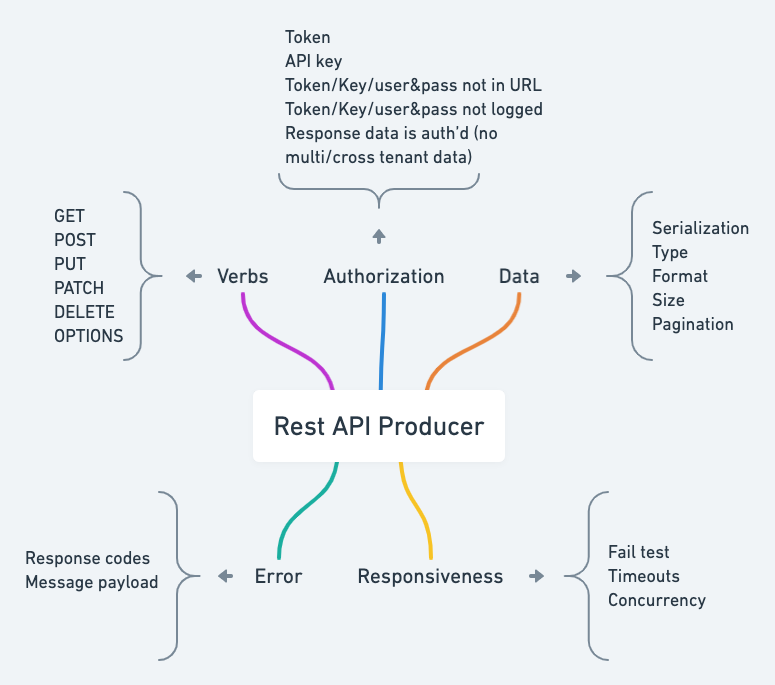

# VADER

**Criador:** Stuart Ashman

## O que é a Heurística VADER

A Heurística Vader foi criado por Stuart Ashman. A VADER está focada em testar APIs rest. Ashman nomeou o heurístico em homenagem a Darth Vader como um mnemônico (uma técnica de memorização) já que o objetivo do VADER é trabalhar com Verbos, Autorização, Dados, Erros e Responsividade. Pode-se dizer que esses são os elementos mais importantes ao usar uma API e devem ser levados em conta em nossos testes.

O que Ashman imaginou está representado na figura abaixo. O objetivo é descrever seus cenários de teste com base nesses cinco pilares:

- **Verbs**: Ao trabalhar com uma API rest ou API GraphQL e falar sobre verbos, precisamos saber a função de cada verbo http e se cada um é usado corretamente.

- **Authorization**: Quando falamos em autorização, devemos ser capazes de identificar todas as falhas de segurança.

- **Data**: Precisamos entender a estrutura de retorno desses dados, bem como seus tipos de parâmetros, paginações, tamanho esperado do caractere e todos os tipos de dados que são recebidos pelos pontos finais.

- **Errors**: precisamos ser capazes de identificar facilmente a causa dos erros; Desta forma, todos os erros precisam ser tratados adequadamente e seu código de status deve ser usado corretamente.

- **Responsiveness**: Devemos garantir que o comportamento da API seja como esperado; isso inclui falhas de solicitação, intervalos e, especialmente, cenários em que não responde satisfatoriamente a um grande número de solicitações.

- [LEIA PARA SABER COMO USAR A HEURÍSTICA](https://medium.com/revista-tspi/chama-o-darth-vader-para-te-ajudar-a-testar-as-apis-4fafc5846b32)
- [VADER](https://qa-matters.com/2016/07/30/vader-a-rest-api-test-heuristic/)
- [Julio de Lima - Essa é uma heurística muito utilizada em Testes de API Rest](https://www.youtube.com/watch?v=fcLm2UqmtS8)
